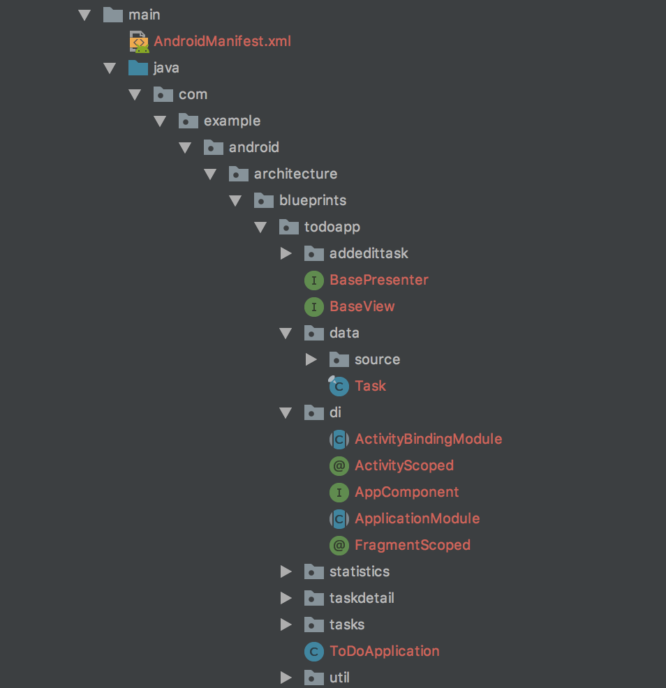
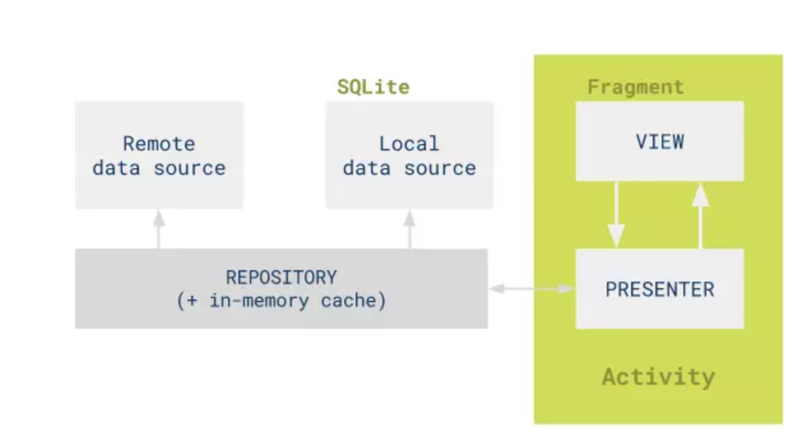

## 一、MVP简介

* Model: 数据层，负责与网络层和数据库层的逻辑交互。
* View: UI层，显示数据, 并向Presenter报告用户行为。
* Presenter: 从Model拿数据，应用到UI层，管理UI的状态，响应用户的行为。

## 二.MVP 优势
* 分离了视图逻辑和业务逻辑，降低了耦合。
* Activity只处理生命周期的任务，代码变得更加简洁。
* 视图逻辑和业务逻辑分别抽象到了View和Presenter的接口中，提高代码的阅读性。
* Presenter被抽象成接口，可以有多种具体的实现，所以方便进行单元测试。
* 把业务逻辑抽到Presenter中去，避免后台线程引用着Activity导致Activity的资源无法被系统回收从而引起内存泄露和OOM。

## 三.Google todo-dagger-mvp 架构解析

### 1.项目结构如下：

从上图可以看出，**todo-mvp**是按照功能模块划分的：
1.**tasks, taskdetail, addedittask, statistics**是四个业务模块。

2.**data**是数据模块，其中具体的类TasksRepository担任Model层，负责远程和本地数据的获取。

3.**BasePresenter**和**BaseView**是presenter 和 view 的基类，在具体模块承担实际功能。

4.**di**使用dagger来提供依赖注入

### 2.MVP的具体架构

### 3.

