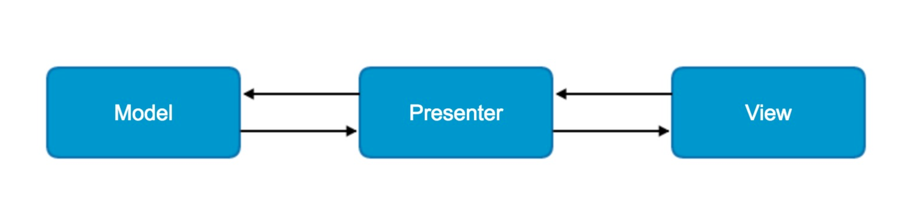

## 一、MVP简介



* Model: 数据层，负责与网络层和数据库层的逻辑交互。
* View: UI层，显示数据, 并向Presenter报告用户行为。
* Presenter: 从Model拿数据，应用到UI层，管理UI的状态，响应用户的行为。

## 二.MVP 优势

* 分离了视图逻辑和业务逻辑，降低了耦合。
* Activity只处理生命周期的任务，代码变得更加简洁。
* 视图逻辑和业务逻辑分别抽象到了View和Presenter的接口中，提高代码的阅读性。
* Presenter被抽象成接口，可以有多种具体的实现，所以方便进行单元测试。
* 把业务逻辑抽到Presenter中去，避免后台线程引用着Activity导致Activity的资源无法被系统回收从而引起内存泄露和OOM。

## 三.Demo 项目简介

整个项目使用mvp + dagger的基本方式搭建。基本架构如下：

**app module code architecture:**

~~~
├── MainApplication.java
├── activity
│   └── MainActivity.java
├── di
│   ├── component
│   │   └── MainActivityComponent.java
│   └── module
│       └── MainActivityModule.java
├── model
└── mvp
    ├── presenter
    │   └── MainActivityPresenter.java
    └── view
        └── MainActivityView.java


~~~

**baseLibrary module code architecture:**

~~~
├── BaseApplication.java
├── di
│   ├── component
│   │   ├── ActivityComponent.java
│   │   └── AppComponent.java
│   ├── module
│   │   ├── ActivityModule.java
│   │   └── AppModule.java
│   └── scope
│       ├── ActivityScope.java
│       └── BusinessScope.java
├── model
│   ├── AppService.java
│   ├── BaseResponse.java
│   ├── CustomTrustManager.java
│   ├── Peotry.java
│   └── UserInfo.java
├── mvp
│   ├── BaseMVPActivity.java
│   ├── BaseMVPFragment.java
│   ├── BasePresenter.java
│   └── BaseView.java
├── rx
│   └── RxUtils.java
├── util
└── widget
~~~

## dagger 部分：
#### 1.AppModule 用来提供App 全生命周期的依赖单例，并通过AppComponent暴露出去；

**AppModule:**
```
/**
 * 拥有全局生命周期的单例都在这个AppModule中提供
 */
@Module
public class AppModule {

    private Context mApplicationContext;

    public AppModule(Context applicationContext) {
        mApplicationContext = applicationContext;
    }

    @Singleton
    @Provides
    Context provideApplicationContext() {
        return mApplicationContext;
    }

    @Singleton
    @Provides
    AppService provideAppService(Retrofit retrofit) {
        return retrofit.create(AppService.class);
    }

    @Singleton
    @Provides
    HostnameVerifier provideHostnameVerifier() {
        HostnameVerifier hostnameVerifier = new HostnameVerifier() {
            public boolean verify(String hostname, SSLSession session) {
                return true;
            }
        };
        return hostnameVerifier;
    }

    @Singleton
    @Provides
    OkHttpClient provideOkHttp(HostnameVerifier hostnameVerifier) {
        HttpsUtils.SSLParams sslParams = HttpsUtils.getSslSocketFactory(null, null, null);
        return new OkHttpClient.Builder()
                .connectTimeout(5, TimeUnit.SECONDS)
                .readTimeout(10, TimeUnit.SECONDS)
                .connectionSpecs(Arrays.asList(ConnectionSpec.MODERN_TLS, ConnectionSpec.CLEARTEXT))
                .sslSocketFactory(sslParams.sSLSocketFactory, sslParams.trustManager)
                .hostnameVerifier(hostnameVerifier)
                .build();
    }

    @Singleton
    @Provides
    Retrofit provideRetrofit(OkHttpClient okHttpClient) {
        return new Retrofit.Builder().baseUrl("https://api.apiopen.top")
                .client(okHttpClient)
                .addCallAdapterFactory(RxJavaCallAdapterFactory.create())
                .addConverterFactory(GsonConverterFactory.create())
                .build();
    }
```

**AppComponent:**

```
@Singleton
@Component(modules = AppModule.class)
public interface AppComponent {
    Context appContext();

    AppService appService();
}
```

#### 2.ActivityModule用来提供具体的Activity生命周期的依赖单例，ActivityComponent 通过依赖ActivityModule 以及AppComponent 暴露出APP全局生命周期对象以及Activity生命周期对象

**ActivityModule:**
```
/**
 * 拥有Activity生命周期的单例从这里提供
 */
@Module
public class ActivityModule {
    RxAppCompatActivity mActivity;

    public ActivityModule(RxAppCompatActivity activity) {
        mActivity = activity;
    }

    @ActivityScope
    @Provides
    RxAppCompatActivity provideActivity(){
        return mActivity;
    }
}
```

**ActivityComponent:**

```
@ActivityScope
@Component(modules = {ActivityModule.class} , dependencies = AppComponent.class)
public interface ActivityComponent {

    Context appContext();

    RxAppCompatActivity activity();

    AppService appService();
}
```

#### 3.具体Activity的 DI 依赖.
以MainActivity 为例。MainActivityModule 提供MainActivityPresenter。MainActivityComponent 通过依赖 MainActivityModule 以及ActivityComponent,将presenter注入对应的Activity。

**MainActivityModule:**
```
@Module
public class MainActivityModule {

    @BusinessScope
    @Provides
    MainActivityPresenter provideMainActivityPresenter(AppService appService, RxAppCompatActivity mActivity){
     return new MainActivityPresenter(appService,mActivity);
    }
}
```

**MainActivityComponent:**
```
@BusinessScope
@Component(modules = MainActivityModule.class, dependencies = ActivityComponent.class)
public interface MainActivityComponent {
    void inject(MainActivity mainActivity);
}
```

## MVP 部分：

#### 1.BaseView


```
public interface BaseView{

     void showLoading();

     void hideLoading();

     void onError();
}
```

#### 2.BasePresenter
```

public class BasePresenter<T extends BaseView> {

    public T mView;

    public void attachView(T view) {
        mView = view;
    }

    public void detachView() {
        mView = null;
    }
}
```
#### 3.简单使用:

**MainActivityView：**
继承于BaseView接口，同时扩展了一个showResult方法用来显示网络请求成功后的内容显示
```
 public interface MainActivityView extends BaseView {
     void showResult(String result);
}
```

**MainActivity:**
实现了MainActivityView接口，并注入MainActivityPresenter.在生命周期onResume and onDestroy调用对应Presenter的attachView and detachView来防止内存泄漏；
```
public class MainActivity extends BaseMVPActivity implements MainActivityView {

    @Inject
    MainActivityPresenter mPresenter;

    TextView mTextView;

    @Override
    protected void onCreate(@Nullable Bundle savedInstanceState) {
        super.onCreate(savedInstanceState);
        setContentView(R.layout.activity_main);
        mTextView = (TextView) findViewById(R.id.tv_result);

        findViewById(R.id.fetch).setOnClickListener(new View.OnClickListener() {
            @Override
            public void onClick(View v) {
                mPresenter.getPoetry();
            }
        });
    }

    @Override
    protected void InjectComponent() {
        DaggerMainActivityComponent.builder().activityComponent(getActivityComponent()).build().inject(this);
    }

    @Override
    protected void onResume() {
        super.onResume();
        mPresenter.attachView(this);
    }

    @Override
    protected void onDestroy() {
        super.onDestroy();
        mPresenter.detachView();
    }

    @Override
    public void onError() {
        Toast.makeText(this, "网络出错了", Toast.LENGTH_SHORT).show();
    }

    @Override
    public void showResult(String result) {
        mTextView.setText(result);
    }
}
```

**MainActivityPresenter:**

构造中注入对应的Appservice 以及RxActivity 实例对象：

```
public class MainActivityPresenter extends BasePresenter<MainActivityView> {

    AppService mAppService;
    RxAppCompatActivity mRxActivity;

    @Inject
    public MainActivityPresenter(AppService appService, RxAppCompatActivity rxActivity) {
        mAppService = appService;
        mRxActivity = rxActivity;
    }

    public void getPoetry() {

        if (mView != null) {
            mView.showLoading();
        }

        mAppService.getPoetry(1, 20)
                .compose(mRxActivity.<Peotry>bindToLifecycle())
                .compose(RxUtils.<Peotry>switchIOAndMainThreadTransformer())
                .subscribe(new RxUtils.SimpleSubscriber<Peotry>() {
                    @Override
                    public void onError(Throwable e) {
                        if (mView != null) {
                            mView.hideLoading();
                            mView.onError();

                        }
                        e.printStackTrace();
                    }

                    @Override
                    public void onNext(Peotry peotry) {
                        if (mView != null) {
                            mView.hideLoading();
                            mView.showResult(peotry.toString());
                        }
                    }
                });
    }
}
```


